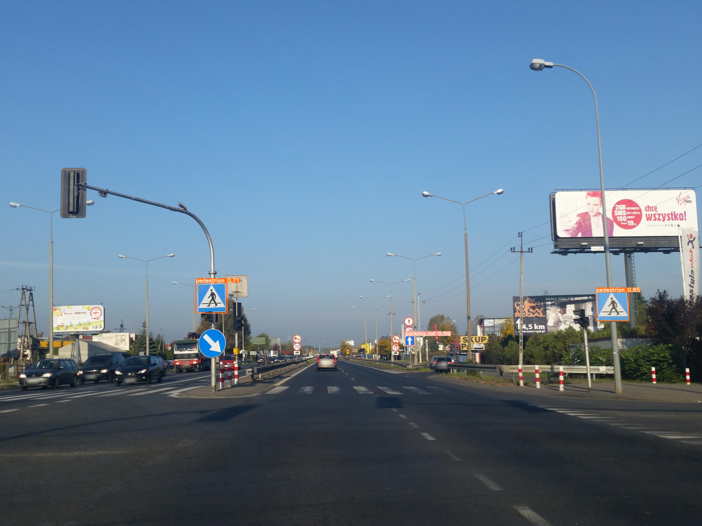

# AI_TrafficSignObjectDetection
Traffic Sign Object Detection With YOLOv5 Convolutional Neural Networks.

## Summary
In this project, with using yolov5 algorithm and neural network, we collect, labeled, classified and trained 17 classes of traffic sign which can be detected with our final model.  
All traffic signs can be detect by their position on the picture or video which can be previewed by a square around its shape.

A simple detection is like the picture below:

